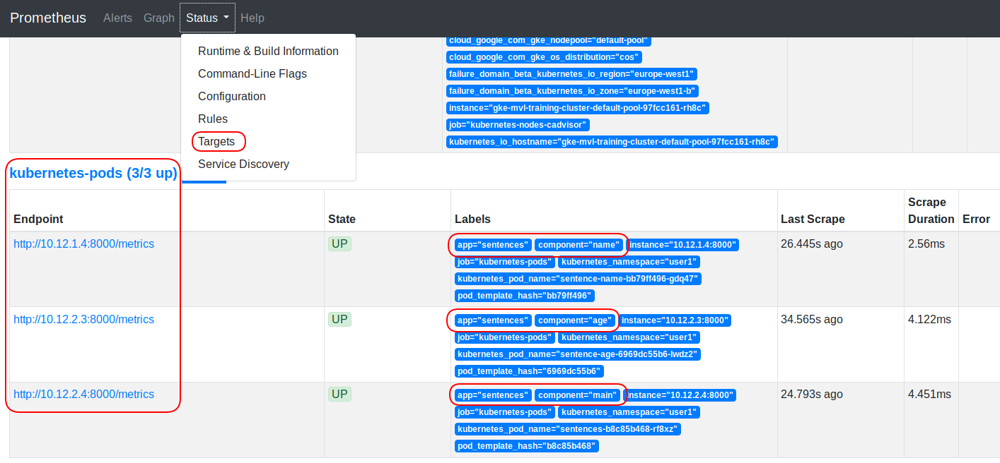
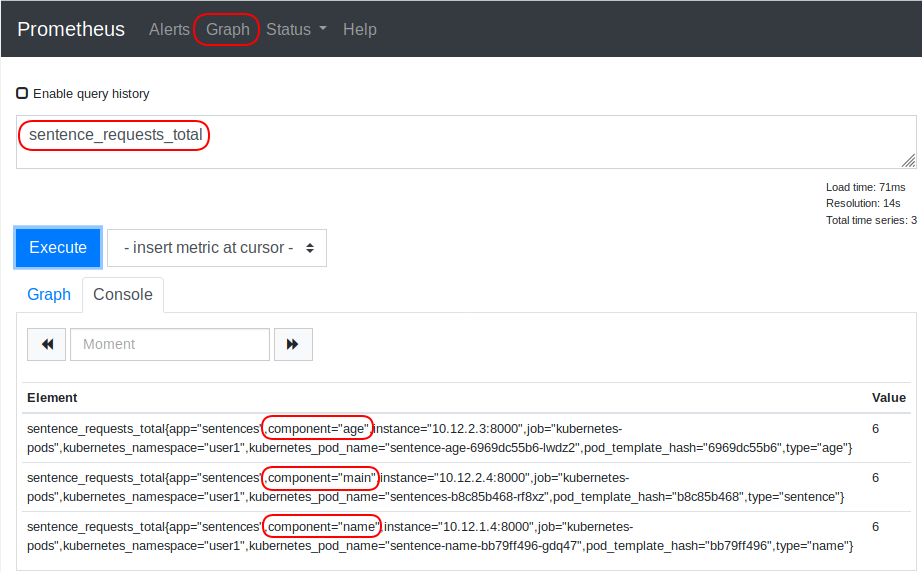
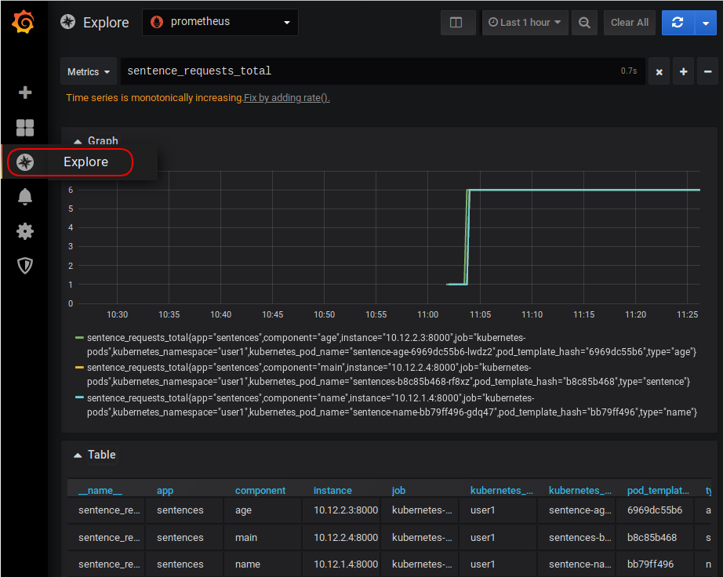

# Introducinc Prometheus and Grafana

This exercise will demonstrate deploying the Prometheus and Grafana applications using Helm.

... TODO

## Deploying Prometheus and Grafana

First we will install Prometheus and Grafana using Helm. We will install them
from the `stable` repository. To see available repositories use:

First add a repository to your Helm installation:

```shell
$ helm3 repo add stable https://kubernetes-charts.storage.googleapis.com/
```

Next, you can inspect your Helm repositories with `helm repo list`:

```shell
$ helm repo list
stable  https://kubernetes-charts.storage.googleapis.com
```

To look for available Helm chart you can use the `helm search` feature, e.g.:

```shell
$ helm2 search prometheus
$ helm3 search repo prometheus
stable/prometheus                       9.2.0           2.13.1          Prometheus is a monitoring system and time seri...
```

This show that Prometheus chart version 9.2.0 is available and that the version
of the Prometheus application in that chart is 2.13.1.  You most likely will see
newer versions when trying this out...

To install Prometheus and Grafana with settings suitable for the following
exercises use the following commands:

```shell
helm3 install prometheus stable/prometheus --version 9.2.0 -f resources/values-prometheus.yaml
helm3 install grafana stable/grafana --version 4.0.1 -f resources/values-grafana.yaml
```

After running these command you can inspect the installed Helm-based
applications with `helm ls`:

```shell
$ helm ls
grafana         user1           1               2019-11-04 09:23:52.163779429 +0000 UTC deployed        grafana-4.0.1
prometheus      user1           1               2019-11-04 08:49:53.769610017 +0000 UTC deployed        prometheus-9.2.0
```

Also, inspect the PODs that these applications are based upon:

```shell
$ kubectl get pods
grafana-5c7b9b967f-pnkd2             2/2     Running   0          71s
prometheus-server-868b8cdb59-d7gpq   2/2     Running   0          48s
```

Note that Grafana is deployed **without TLS** and as such this is not a
deployment that is suitable for production use.

Grafana is exposed with a Kubernetes service of type `LoadBalancer`. Use the
following commands to get the external IP address/port and the Grafana `admin`
user password:

```shell
$ kubectl get -o jsonpath="{.spec.ports[0].nodePort}" services grafana
$ kubectl get nodes -o jsonpath="{.items[0].status.addresses[1].address}"
$ kubectl get secret grafana -o jsonpath="{.data.admin-password}" | base64 --decode ; echo
```

## Deploying the Application

The sentences application can be deployed with the following command. If you
created a Helm chart for the application in a previous exercise feel free to use
that chart for deploying the sentences application.

```shell
$ kubectl apply -f sentences-app/deploy/kubernetes/
```

After this, we should have 5 PODs running (Prometheus, Grafana and three PODs for the sentences application).

## Debugging Metrics

### Debugging Metrics From PODs

```shell
$ kubectl expose deploy sentences --name sentences-metrics --port 8000 --target-port 8000 --type NodePort
```

```shell
$ curl -s 34.76.215.187:<PORT>/metrics | egrep '^sentence'
```

```
sentence_requests_total{type="sentence"} 6.0
```


### Debugging Prometheus Metrics Scraping

```shell
$ kubectl get -o jsonpath="{.spec.ports[0].nodePort}" services prometheus-server
```





## Explore Metrics in Grafana



## Deploying a Dashboard

```shell
$ kubectl create configmap dashboard --from-file sentences-app/dashboard.json
$ kubectl label configmap dashboard grafana_dashboard='1'
```


# Cleanup

Delete the applications and additional services with the following commands:

```shell
$ kubectl delete -f sentences-app/deploy/kubernetes/
$ helm3 delete grafana
$ helm3 delete prometheus
$ kubectl delete svc sentences-metrics
```
