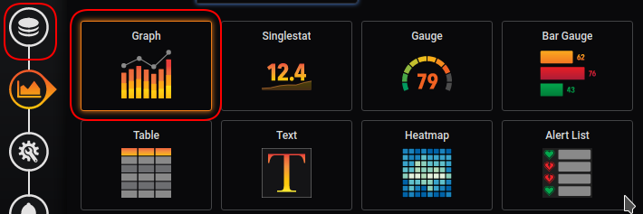

# Prometheus Metrics and Grafana Dashboards

In this exercise we will build upon the knowledge from the [Introducing
Prometheus and Grafana](introducing-prometheus-and-grafana.md) exercise.

We will learn about Prometheus query functions and operators and we will build a
dashboard for the sentences application.

This exercise assumes you have Prometheus, Grafana and the sentences application
and load generator running. If not, see the [Introducing Prometheus and
Grafana](introducing-prometheus-and-grafana.md) exercise.

In addition, ensure that the load generator is running (see previous exercise),
and that the front-end sentences microservice is scaled to three replicas:

```shell
$ kubectl scale --replicas 3 deployment sentences
```

## Choose Metric Queries

The first thing to do before creating a dashboard is to chose a query that
return a metric we want to display in a dashboard.  Go to the Grafana *explore*
feature and in the query box type the metrics name `sentence_requests_total`.

Since this metric is a counter which increases on each request, we will see a
curve going towards the top-right part of the Grafana graph of the
`sentence_requests_total` metric.

Number of requests are typically easier to understand when given over time. We
can change the query which Grafana sends to Prometheus to 

```
rate(sentence_requests_total[2m])*60
```

With this query, Prometheus will return metrics with a per-second average
measured over the last 2 minutes. We can include general math in the query also,
and we here convert the metric into a requests/minute metric.

We now have found the first metric query for our dashboard.

## Metric Labels

The data returned with the above query results in five different curves and the
table also show five results. The results differ in the labels, e.g. observe the
value of the `type` label -- you should be able to find `sentence`, `age` and
`name`.

In addition, we see that e.g. the `kubernetes_pod_name` label have different
values matching the actual POD names of our deployed PODs. Compare the
`kubernetes_pod_name` label values with the following command to verify this:

```shell
$ kubectl get pods
```

Thus we have a `sentence_request_total` from each POD, however, for our second
metric query in our dashboard we want request/minute for each microservice type.

This can be done by using the Prometheus `sum()` aggregation operator. First,
enter the following query into Grafana:

```
sum(rate(sentence_requests_total[2m]))
```

this results in a single curve, hence all the `sentence_requests_total` metrics
from all microservices have been aggregated into a single metric which is not
what we wanted.

We need to specify to the `sum()` operator across which labels we want
aggregation. Instead enter the following query which specifies the `sum()` to
happen across the values of the `type` label.

```
sum by (type) (rate(sentence_requests_total[2m]))
```

This will be our second metric query for our dashboard.

There are many [Prometheus
functions](https://prometheus.io/docs/prometheus/latest/querying/functions/) and
[Prometheus
operators](https://prometheus.io/docs/prometheus/latest/querying/operators/)
that provide many options for querying metrics.

## Create a Dashboard

Go back to the main page of Grafana by selecting the *Dashboards* (four squares)
button above the *explore* button and select the *New dashboard* button in the
middle of the window as shown below:


Next, select *Choose visualization* after which you should see options for the
visualization. In this menu, select the *graph* visualization and next the
*database query* (three disks above each other) as shown below:



Selecting the *database query* will allow us to enter Prometheus queries which
will be displayed with a graph visualization. Queries are entered in the field
starting with `Metrics` as shown below:


In this field enter our first Prometheus metric query:

```
rate(sentence_requests_total[2m])*60
```

After this, the metric will show up as a graph and very long legend names below
the graph. Below the `Metrics` field in the `Legend` box enter the following to
allow Grafana to generate legends using the values of the `type` and
`kubernetes_pod_name` labels.

```
{{type}}-{{kubernetes_pod_name}}
```

The graph title currently says "Panel Title". To change this, select the "gear
and wrench" button to the far left to enter the *general* setup of the
visualization. In the field named "Title" enter "Requests/minute".

To finalize the first part of the dashboard, select the *back arrow* in the
top-left corner.  To add another graph, select the *Add panel* button as shown
below and repeat for our second metric.


## Re-arranging Visualizations and Saving Dashboards

When you have added the second metric and used the *back arrow* to go back to
the main dashboard page, you can re-arrange and re-size the panels using the
mouse.

The dashboard can be saved by using the *Save dashboard* button in th top-right
corner next to the *Add panel* button.  After the dashboard has been saved, a
*Share dashboard* button will show up.  Press the *Share dashboard* button,
select the *Export* tab and *Save to file*. This will start a download of the
dashboard in JSON format.

## Importing the Saved Dashboard

In the [Introducing Prometheus and
Grafana](introducing-prometheus-and-grafana.md) exercise we loaded an existing
dashboard. Now that we have created our own dashboard we can load into Grafana.
First delete the current dashboard by selecting the *Dashboard settings* button
to the right of the *Save dashboard* button in the top-right corner.

Next, you will have to copy the dashboard from where you downloaded it and onto
the VM instance where you are running kubectl commands.  This will similar to
the SSH command you used to connect to the machine, i.e. something like to
following assuming you saved the dashboard as ``my-dashboard.json::

```shell
$ scp -i <key> my-dashboard.json ubuntu@<IP-address>:.
```

```shell
$ kubectl create configmap dashboard --from-file my-dashboard.json
$ kubectl label configmap dashboard grafana_dashboard='1'
```

Grafana should now automatically load the dashboard and you can select it by
using the *Dasboards* button in the left-side of the window (possibly select the
*Home* and *Manage* sub-options a few times)

The dashboard can now be stored in e.g. git together with the remaining
application artifacts.

## Cleanup

See cleanup in the [Introducing Prometheus and
Grafana](introducing-prometheus-and-grafana.md) exercise